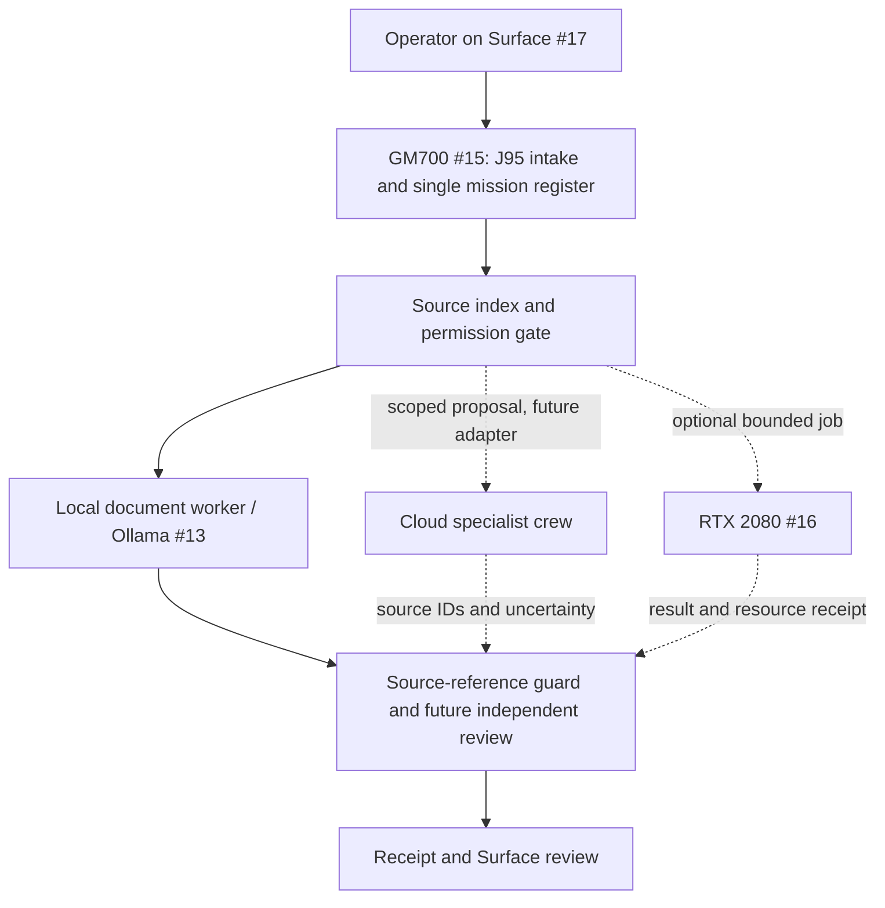

# Net95X mission console — design and MockFlow handoff

**Status:** design and runnable fixture prototype. No MockFlow board was created in this cloud session. No device, account, or historical conversation is connected by this document or the prototype.

## The operating model

The Windows 11 app on **#15 GM700** is the proposed control surface over existing software. It should present the existing Core's single mission register, permission decisions, source index, adapter routing, and durable receipts, without creating a second mission authority. It does not replace Windows or grant itself operating system privileges. **#16 RTX 2080 gaming PC** is an optional bounded compute worker, preserving gaming priority. **#17 Surface Pro X** is the mobile capture and human review surface. An unavailable device reports `UNKNOWN/OFFLINE`; it does not silently become another source of truth.

The first useful end-to-end mission is a **sample supplied business document/folder → source-linked brief → local source-reference check → review acknowledgement receipt**. The screens and data in `apps/net95x-console` demonstrate that lifecycle with fixtures. An independent reviewer and real Surface decision remain future integrations. The existing native bridge has loopback/synthetic receipts; neither that bridge nor this interface proves physical pairing, live model dispatch, or a deployed three-device mesh.



Solid arrows describe the **prototype's simulated workflow**, not a live integration. Dashed arrows are proposed adapters. Any live adapter must declare its identity, scope, source handling, cost, timeout, and failure behavior before activation.

## Crew instructions and history boundaries

Each product has its own account and conversation history. Net95X should store a **source pointer, user-granted export or selected artifact, timestamp, access scope, model/version when available, digest, and retention rule** for each admitted item. Do not assume that an API can bulk read a product's private chat history. A task may cite a selected export while its original history remains with that provider. Imported items enter a quarantine/review step before they can become mission evidence.

| ID | Specialist | Instruction in a Net95X mission | History admitted to local index |
| --- | --- | --- | --- |
| 1 | Grok | Challenge assumptions, scan current public signals, return dated sources and counterexamples. | User-selected research export or cited result; separate from provider history. |
| 2 | Unassigned | Reserve this number until the operator names it. | None. |
| 3 | Groq | Run fast, bounded inference or structured extraction when an approved API route is configured. | Request ID, schema, usage, and result digest; no implied access to Groq account history. |
| 4 | Windows Copilot | Help the operator with Windows 11 tasks and settings in its supported UI. | Operator-selected output only; OS permissions remain explicit. |
| 5 | Microsoft 365 Copilot | Summarize authorized tenant documents and meetings with their access controls. | Document links, tenant scope, sensitivity label, and citations when export is permitted. |
| 6 | Copilot Cowork | Coordinate Microsoft 365 work, draft follow-ups and show approval points. | Task reference and reviewed output; preserve Microsoft 365 permissions. |
| 7 | OpenClaw Companion | Capture operator intent and device status through a paired local interface. | Paired device identity, command receipt, and selected transcript. |
| 8 | OpenClaw Web | Perform bounded web actions after site and account scope is approved. | URLs, action log, screenshot/receipt; hold consequential sends. |
| 9 | Perplexity | Research with explicit citations and freshness. | Selected answer, links, retrieval time, uncertainty. |
| 10 | ChatGPT Pro | Synthesize competing research and draft decisions for review. | User-selected conversation/export and artifact IDs, not automatic private history. |
| 11A | Codex A | Build a scoped implementation in a branch or local workspace. | Repository, commit/PR, tests and diff. |
| 11B | Codex B | Review A's work independently against requirements and evidence when assigned. | Findings and review receipt, separate from builder claims. |
| 12 | ChatGPT Dot | Capture voice or quick intent if available on the chosen client. | Selected transcript, explicit timestamp and consent. |
| 13 | Ollama | Run private local inference on admitted source material. | Local model/version, prompt template ID, result digest, token/runtime receipt. |
| 14 | Office Agent | Create or refine editable Word, Excel, and PowerPoint deliverables from a verified brief. | File/version link, source mapping, review decision; preview and tenant eligibility need validation. |
| 15 | GM700 | Host the Windows 11 Net95X control layer and authoritative task state. | Mission log, source index, policy, receipts and backup. |
| 16 | RTX 2080 PC | Handle optional GPU jobs only when resource and device state allow. | Job ID, model, resource use, result digest; preserve gaming priority. |
| 17 | Surface Pro X | Capture instructions, inspect sources, approve or reject reviews. | Human decision, timestamp, device identity, reviewed version. |
| 18 | Meta AI | Explore authorized Meta social and campaign signals with dated evidence. | Selected output and source references; no automatic personal-history import. |
| 19 | Muse from Meta | Propose scoped follow-ups and return action receipts through a future adapter. | Selected task IDs/output; custom connector and account access must be verified. |

Treat model answers as proposals. Only the GM700 mission register advances a task; only a verified source or authorized human decision changes evidence or permission state. Planned integrations should appear in the UI as `DISCONNECTED` until tested with the actual account and device.

## J95 mission contract

```text
J95::BUILD::Prototype a source-linked Net95X business brief | target=GM700;Surface Pro X;optional RTX 2080 | scope=fixture intake;draft;independent review;receipt | depth=4 | evidence=label proposed versus verified | authority=build | tools=local prototype;GitHub branch;MockFlow when locally paired | output=editable board handoff and runnable console | done=one sample mission visibly reaches a review receipt with source IDs and guards intact | guard=no live device control;no account-history import;no outbound send;preserve existing filing gates
```

The parser/renderer can preserve the nine registers: intent, target, scope, context, evidence, authority, resources, output, done. A `RUN` command cannot inherit `BUILD` authority, and a rendered screen is not an execution receipt.

## MockFlow construction brief

The editable board requires the **MockFlow local bridge paired to the user's board on the same Windows machine**. In a local Codex desktop/CLI session, start `mockflow-bridge`, open the target board at app.mockflow.com, use **Ask Mida → Connect Local Agent** and the current pairing code, then confirm `list_boards` and `select_board`. Draw components as a batch and call `layout_board` once. This session has no paired board or bridge; the following is a handoff for that local session.

Board title: **Net95X — one mission, three devices, specialist crew**. Make six editable frames in a top-down flow:

| Frame | Cards | Visual state |
| --- | --- | --- |
| 1. Command / Surface #17 | Operator objective; Dot intake; companion status; human review | Surface is proposed; review is human. |
| 2. Control / GM700 #15 | Task register; J95 contract; source/history index; permission and budget gate; router | One authoritative task state. |
| 3. Specialists | Research: Grok/Perplexity/Meta AI; fast processing: Groq; synthesis: ChatGPT Pro; Microsoft: M365 Copilot/Cowork/Office Agent; execution: Codex A/OpenClaw Web; independent check: Codex B; device support: Windows Copilot; Muse proposals | Each card has a provenance and approval port. All adapters planned until proven. |
| 4. Local compute / RTX #16 and Ollama #13 | Local extraction; optional GPU job; gaming-priority resource gate; runtime/cost receipt | RTX availability is unknown; Ollama routing is proposed. |
| 5. Proof / GM700 | Draft brief; source IDs; verifier result; action receipt; current status | No “complete” without all four. |
| 6. Learning | Measured time/cost; accepted lesson; replay before promotion | Improvements remain proposals until tested. |

Connect **sample intake → fixture task → permission gate → fixture extraction → source-linked brief → local reference guard → simulated receipt/review** with solid arrows labeled *fixture demonstration*. Draw dashed arrows from router to specialist adapters, including Codex B's future independent check, returning **output + source ID + uncertainty**. Connect proof → learning → router as **tested improvement**. Legend: solid = demonstrated in fixture; dashed = proposed; amber = account/device validation needed. Do not depict histories as imported or devices as online.

The walkthrough ribbon reads: `S-001 sample business folder → capture objective → index sample record → local extraction proposal → draft brief → verify claims and source IDs → Surface review → save fixture receipt`. End card: `DONE when draft, source IDs, verifier result and task status agree`. A separate `DIS-00` review hold and outbound `REV-002` freeze stay visible as guards, not as executable buttons.

## Three builds in order

1. **Mission control and provenance:** one task register, J95 intake, adapter manifest, history/source index, budget/permission gate, and receipts on GM700. Verify C1–C3 before adding live dispatch.
2. **Source-linked brief factory:** admit a supplied folder, parse and cite records, draft a brief, independently verify claims, and collect Surface review. Start with a bounded format fixture. The existing integration sequence requires a supported connector at C4, real folder-to-brief plus recovery at C5, and measured paid pilots at C6.
3. **Device and crew cockpit:** show paired device health, job eligibility, specialist cost/provenance, approvals and recovery. Add RTX and cloud routes only after measured proofs. Preserve the existing outbound and case filing holds.

## Acceptance boundary

The prototype succeeds when a reviewer can run the fixture, trace the source IDs into a draft, see the local source-reference guard and a simulated review receipt, inspect the reverse-order device map (#17 → #16 → #15), and understand exactly which connections are still planned. Independent verification, physical telemetry, production account access, local model execution, live history exports, and a completed MockFlow board require separate verification.
